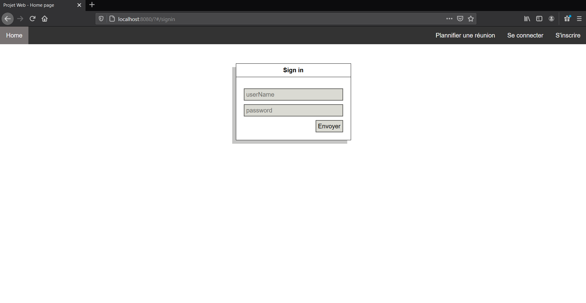
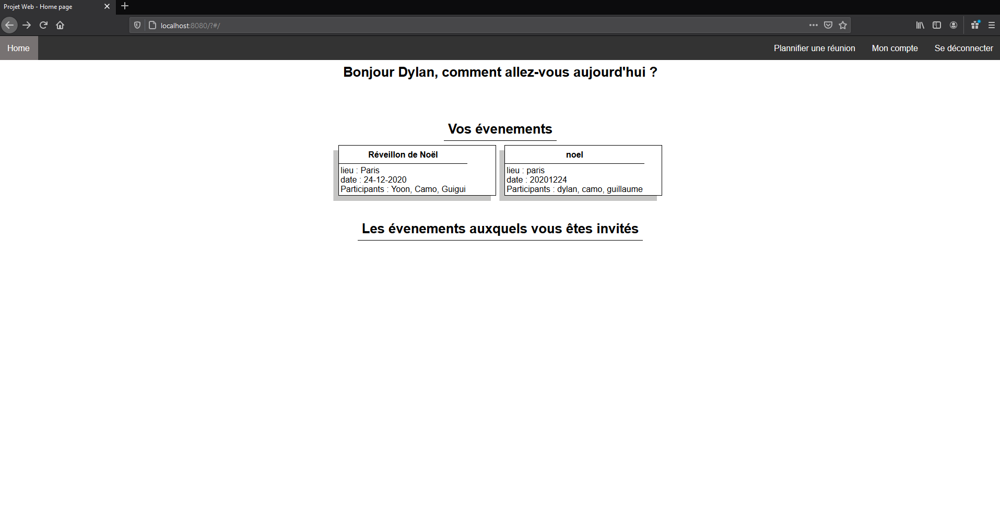
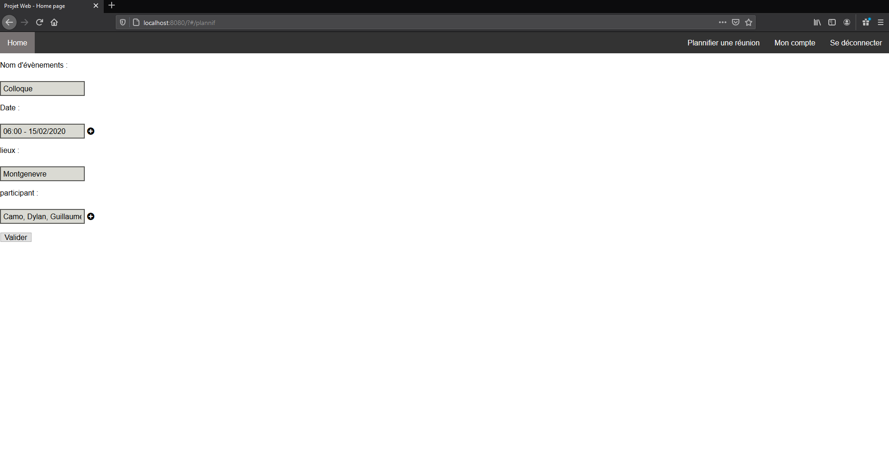
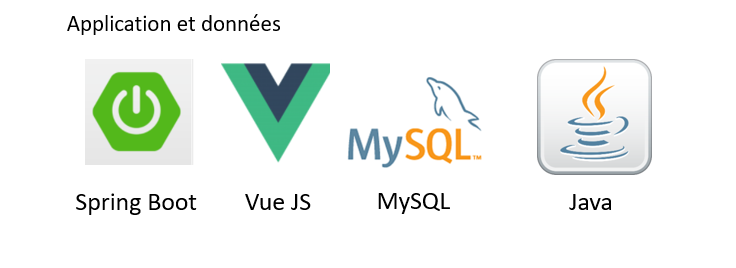

# Project-Web

### **I. Prérequis**

Créer une base de données.

### **II. Execution du projet - Côté Backend**

Sur l'IDE IntelliJ Idea :

- Ajouter la configuration Maven et mettre en command-line "spring-boot:run"

- Ouvrir le dossier Back du projet puis ouvrir le fichier ressources/application.properties

- Dans ressources/application.properties, renseigner le port et l'url (jdbc:mysql://localhost:3306/projectweb) de la base de données ainsi que le nom de l'utilisateur et son mot de passe

- Executer Backend avec spring-boot:run

### III.  Execution du projet - Côté Frontend

Sur l'IDE IntelliJ Idea ou Visual Studio Code : 

- Ouvrir le dossier Front du projet

- Taper dans le terminal de l'IDE ou dans un cmd : "npm install"

- Toujours dans le terminal, taper : "npm run dev"

### Présentation de l'interface du site web

Page de connexion

Homepage

### Fonctionnalités disponibles

Plannification d'événements :
Les participants ajoutés à l'événements ci-dessous verront l'événement sur leur Homepage une fois connecté à leur compte

### Schéma de la base de données

### Stack technique

